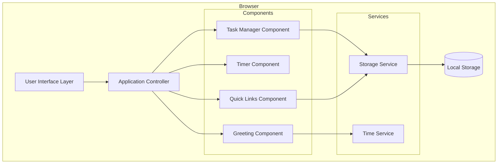
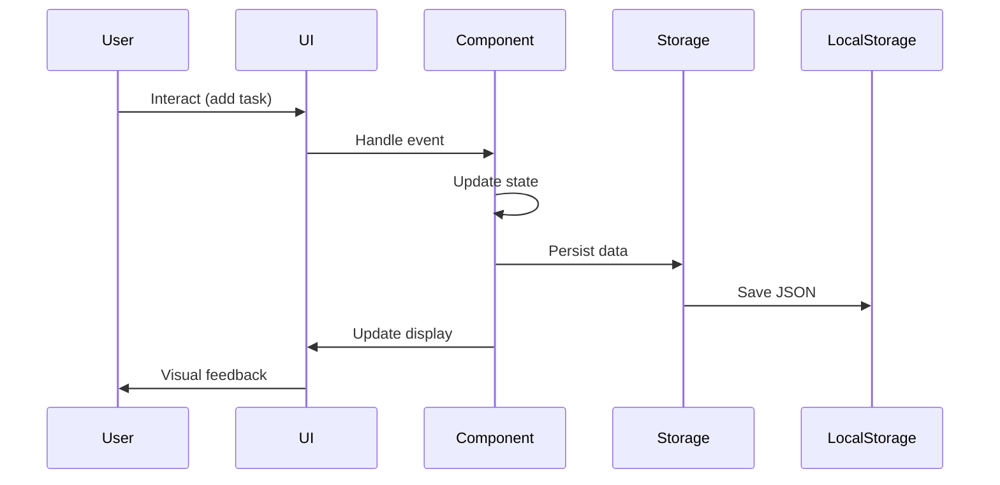

# Design Document: Todo List Life Dashboard

## Overview

The Todo List Life Dashboard is a single-page web application built with vanilla HTML, CSS, and JavaScript that provides a personal productivity interface. The application runs entirely in the browser with no backend dependencies, using the Local Storage API for data persistence.

### Core Features
- **Time Display**: Real-time clock with date and time-based greetings
- **Focus Timer**: 25-minute countdown timer with start/stop/reset controls
- **Task Management**: Full CRUD operations for to-do items with completion tracking
- **Quick Links**: Customizable shortcuts to favorite websites
- **Local Persistence**: All data stored in browser Local Storage

### Design Philosophy
The design emphasizes simplicity, performance, and maintainability through:
- Pure vanilla JavaScript (no frameworks or dependencies)
- Component-based architecture with clear separation of concerns
- Event-driven state management
- Immediate persistence to Local Storage
- Responsive UI updates with visual feedback

## Architecture

### High-Level Architecture



### Architectural Layers

1. **User Interface Layer**: HTML structure and CSS styling
2. **Application Controller**: Initializes components and coordinates interactions
3. **Component Layer**: Self-contained modules for each feature
4. **Service Layer**: Shared utilities for storage and time operations
5. **Data Layer**: Browser Local Storage API

### Component Interaction Flow



## Components and Interfaces

### 1. Application Controller

**Responsibility**: Initialize and coordinate all components

**Interface**:
```javascript
class App {
  constructor()
  init(): void
  setupEventListeners(): void
}
```

**Behavior**:
- Initializes all components on page load
- Sets up global event listeners
- Coordinates component lifecycle

### 2. Greeting Component

**Responsibility**: Display current time, date, and time-based greeting

**Interface**:
```javascript
class GreetingDisplay {
  constructor(containerElement)
  init(): void
  updateTime(): void
  getGreeting(hour): string
  formatTime(date): string
  formatDate(date): string
  startClock(): void
}
```

**State**:
- `intervalId`: Timer reference for clock updates
- `containerElement`: DOM reference for rendering

**Behavior**:
- Updates every second using `setInterval`
- Determines greeting based on current hour (5-11: morning, 12-16: afternoon, 17-20: evening, 21-4: night)
- Formats time in 12-hour format with AM/PM
- Formats date as "Day, Month Date" (e.g., "Monday, January 15")

### 3. Timer Component

**Responsibility**: Manage 25-minute focus timer with start/stop/reset controls

**Interface**:
```javascript
class FocusTimer {
  constructor(containerElement)
  init(): void
  start(): void
  stop(): void
  reset(): void
  tick(): void
  formatTime(seconds): string
  updateDisplay(): void
  showCompletion(): void
}
```

**State**:
```javascript
{
  totalSeconds: number,      // Current countdown value (0-1500)
  isRunning: boolean,        // Timer running state
  intervalId: number | null, // setInterval reference
  containerElement: Element  // DOM reference
}
```

**Behavior**:
- Initializes at 1500 seconds (25 minutes)
- `start()`: Begins countdown if not already running
- `stop()`: Pauses countdown, preserving current value
- `reset()`: Returns to 1500 seconds and stops
- `tick()`: Decrements counter every second, checks for completion
- Displays time as MM:SS format
- Shows visual completion indicator when reaching zero

### 4. Task Manager Component

**Responsibility**: Handle all task CRUD operations and persistence

**Interface**:
```javascript
class TaskManager {
  constructor(containerElement, storageService)
  init(): void
  loadTasks(): void
  createTask(text): Task
  editTask(id, newText): void
  toggleComplete(id): void
  deleteTask(id): void
  renderTasks(): void
  saveTasks(): void
}
```

**State**:
```javascript
{
  tasks: Task[],              // Array of task objects
  containerElement: Element,  // DOM reference
  storageService: StorageService
}
```

**Task Data Model** (see Data Models section)

**Behavior**:
- Loads tasks from Local Storage on initialization
- Creates tasks with unique IDs and incomplete status
- Provides inline editing capability
- Toggles completion status with visual feedback
- Deletes tasks with confirmation
- Persists all changes to Local Storage within 100ms
- Re-renders task list after each operation

### 5. Quick Links Component

**Responsibility**: Manage quick link shortcuts to external URLs

**Interface**:
```javascript
class QuickLinksManager {
  constructor(containerElement, storageService)
  init(): void
  loadLinks(): void
  createLink(name, url): QuickLink
  deleteLink(id): void
  openLink(url): void
  renderLinks(): void
  saveLinks(): void
  validateUrl(url): boolean
}
```

**State**:
```javascript
{
  links: QuickLink[],         // Array of link objects
  containerElement: Element,  // DOM reference
  storageService: StorageService
}
```

**QuickLink Data Model** (see Data Models section)

**Behavior**:
- Loads links from Local Storage on initialization
- Creates links with unique IDs
- Validates URLs before creation
- Opens links in new tabs using `window.open(url, '_blank')`
- Deletes links with confirmation
- Persists all changes to Local Storage within 100ms
- Re-renders link buttons after each operation

### 6. Storage Service

**Responsibility**: Abstract Local Storage operations with JSON serialization

**Interface**:
```javascript
class StorageService {
  get(key): any | null
  set(key, value): void
  remove(key): void
  clear(): void
}
```

**Behavior**:
- Wraps Local Storage API with error handling
- Automatically serializes/deserializes JSON
- Returns `null` for missing keys
- Handles storage quota errors gracefully
- Uses consistent key naming: `dashboard_tasks`, `dashboard_links`

### 7. Time Service

**Responsibility**: Provide time-related utilities

**Interface**:
```javascript
class TimeService {
  getCurrentTime(): Date
  formatTime12Hour(date): string
  formatDate(date): string
  getTimeOfDay(hour): string
}
```

**Behavior**:
- Provides consistent time formatting across components
- Determines time-of-day categories (morning/afternoon/evening/night)
- Encapsulates date/time logic for testability

## Data Models

### Task Model

```javascript
{
  id: string,           // Unique identifier (timestamp-based or UUID)
  text: string,         // Task description
  completed: boolean,   // Completion status
  createdAt: number,    // Unix timestamp
  updatedAt: number     // Unix timestamp
}
```

**Constraints**:
- `id`: Must be unique within the task collection
- `text`: Non-empty string, max 500 characters
- `completed`: Boolean, defaults to `false`
- `createdAt`: Set on creation, immutable
- `updatedAt`: Updated on any modification

### QuickLink Model

```javascript
{
  id: string,    // Unique identifier (timestamp-based or UUID)
  name: string,  // Display name for the link
  url: string    // Target URL
}
```

**Constraints**:
- `id`: Must be unique within the link collection
- `name`: Non-empty string, max 50 characters
- `url`: Valid URL format (http:// or https://)

### Timer State Model

```javascript
{
  totalSeconds: number,      // 0-1500
  isRunning: boolean,        // true/false
  intervalId: number | null  // setInterval reference or null
}
```

**Constraints**:
- `totalSeconds`: Integer between 0 and 1500 (inclusive)
- `isRunning`: Boolean
- `intervalId`: Valid interval ID when running, null when stopped

### Local Storage Schema

**Key: `dashboard_tasks`**
```json
[
  {
    "id": "task_1234567890",
    "text": "Complete project documentation",
    "completed": false,
    "createdAt": 1234567890000,
    "updatedAt": 1234567890000
  }
]
```

**Key: `dashboard_links`**
```json
[
  {
    "id": "link_1234567890",
    "name": "GitHub",
    "url": "https://github.com"
  }
]
```

## Correctness Properties

*A property is a characteristic or behavior that should hold true across all valid executions of a system—essentially, a formal statement about what the system should do. Properties serve as the bridge between human-readable specifications and machine-verifiable correctness guarantees.*


### Property 1: Time Format Correctness

*For any* Date object, the formatTime function SHALL produce a string in 12-hour format (1-12) with AM/PM indicator.

**Validates: Requirements 1.1**

### Property 2: Date Format Completeness

*For any* Date object, the formatDate function SHALL produce a string containing the day of week, month name, and day of month.

**Validates: Requirements 1.2**

### Property 3: Greeting Time-of-Day Mapping

*For any* hour value (0-23), the getGreeting function SHALL return the correct time-based greeting: morning (5-11), afternoon (12-16), evening (17-20), or night (21-4).

**Validates: Requirements 2.1, 2.2, 2.3, 2.4**

### Property 4: Timer Start Behavior

*For any* timer state with a positive totalSeconds value, calling start() SHALL set isRunning to true and begin countdown.

**Validates: Requirements 3.2**

### Property 5: Timer Stop Preservation

*For any* running timer state, calling stop() SHALL preserve the current totalSeconds value and set isRunning to false.

**Validates: Requirements 3.3**

### Property 6: Timer Reset Idempotence

*For any* timer state, calling reset() SHALL set totalSeconds to 1500 and isRunning to false, regardless of the initial state.

**Validates: Requirements 3.4**

### Property 7: Task Creation with Default Status

*For any* non-empty task text, calling createTask SHALL produce a Task object with that text and completed set to false.

**Validates: Requirements 4.1, 4.2**

### Property 8: Task Edit Updates Text

*For any* existing task and any new text, calling editTask SHALL update the task's text property to the new value and update the updatedAt timestamp.

**Validates: Requirements 5.2**

### Property 9: Task Completion Toggle Round-Trip

*For any* task, toggling completion status twice SHALL return the task to its original completion state.

**Validates: Requirements 6.1, 6.4**

### Property 10: Task Deletion Removes from Collection

*For any* task collection and any task ID in that collection, calling deleteTask SHALL produce a collection that does not contain that task ID.

**Validates: Requirements 7.1**

### Property 11: Task Storage Round-Trip

*For any* valid task collection, serializing to JSON and storing in Local Storage, then retrieving and deserializing SHALL produce an equivalent task collection with all task properties preserved.

**Validates: Requirements 4.3, 5.3, 6.2, 7.2, 8.1, 8.4**

### Property 12: Task UI Rendering Consistency

*For any* task collection, calling renderTasks SHALL produce DOM elements where each task in the collection has a corresponding element with the task's text and completion status reflected.

**Validates: Requirements 4.4, 5.4, 6.3, 7.3**

### Property 13: Quick Link Creation

*For any* valid link name and URL, calling createLink SHALL produce a QuickLink object with those values and a unique ID.

**Validates: Requirements 9.1**

### Property 14: Quick Link Deletion Removes from Collection

*For any* link collection and any link ID in that collection, calling deleteLink SHALL produce a collection that does not contain that link ID.

**Validates: Requirements 9.5**

### Property 15: Quick Link Storage Round-Trip

*For any* valid link collection, serializing to JSON and storing in Local Storage, then retrieving and deserializing SHALL produce an equivalent link collection with all link properties preserved.

**Validates: Requirements 9.2, 10.1, 10.4**

### Property 16: Quick Link UI Rendering Consistency

*For any* link collection, calling renderLinks SHALL produce DOM elements where each link in the collection has a corresponding button element with the link's name displayed.

**Validates: Requirements 9.3, 9.6**

## Error Handling

### Storage Errors

**Quota Exceeded**:
- **Detection**: Catch `QuotaExceededError` from Local Storage operations
- **Response**: Display user-friendly error message suggesting to delete old tasks/links
- **Recovery**: Allow continued operation with in-memory state

**Storage Unavailable**:
- **Detection**: Check for Local Storage availability on initialization
- **Response**: Display warning that data will not persist
- **Recovery**: Operate in memory-only mode

**Corrupted Data**:
- **Detection**: JSON parse errors when loading from storage
- **Response**: Log error, clear corrupted data, initialize empty state
- **Recovery**: Start with fresh empty collections

### Input Validation Errors

**Empty Task Text**:
- **Detection**: Check for empty or whitespace-only strings before task creation
- **Response**: Display inline validation message, prevent task creation
- **Recovery**: Keep input field focused for correction

**Invalid URL Format**:
- **Detection**: Validate URL format using regex or URL constructor
- **Response**: Display inline validation message, prevent link creation
- **Recovery**: Keep input field focused for correction

**Excessive Input Length**:
- **Detection**: Check string length before creation (tasks: 500 chars, links: 50 chars)
- **Response**: Display character count and limit warning
- **Recovery**: Truncate or prevent additional input

### Timer Edge Cases

**Timer at Zero**:
- **Behavior**: Prevent negative values, stop countdown, show completion
- **Recovery**: User must reset to continue

**Multiple Start Calls**:
- **Behavior**: Ignore subsequent start calls while already running
- **Recovery**: No action needed, timer continues normally

### DOM Manipulation Errors

**Missing Container Elements**:
- **Detection**: Check for null/undefined container in component constructors
- **Response**: Log error, throw exception during initialization
- **Recovery**: Application fails to initialize (critical error)

**Event Handler Errors**:
- **Detection**: Try-catch blocks in event handlers
- **Response**: Log error, display user-friendly message
- **Recovery**: Prevent error from breaking other functionality

## Testing Strategy

### Overview

The testing strategy employs a dual approach combining property-based testing for universal behaviors with example-based unit tests for specific scenarios and edge cases. This ensures both comprehensive input coverage and validation of critical specific behaviors.

### Property-Based Testing

**Framework**: [fast-check](https://github.com/dubzzz/fast-check) for JavaScript

**Configuration**:
- Minimum 100 iterations per property test
- Each test tagged with format: `Feature: todo-list-life-dashboard, Property {number}: {property_text}`

**Property Test Coverage**:

1. **Time/Date Formatting Properties (1-2)**
   - Generate random Date objects across full range (1970-2100)
   - Verify format patterns using regex
   - Test edge cases: midnight, noon, month boundaries

2. **Greeting Logic Property (3)**
   - Generate random hours (0-23)
   - Verify correct greeting for each time range
   - Test boundary hours (4, 5, 11, 12, 16, 17, 20, 21)

3. **Timer Operation Properties (4-6)**
   - Generate random timer states (0-1500 seconds, running/stopped)
   - Verify state transitions
   - Test boundary values (0, 1, 1500)

4. **Task CRUD Properties (7-12)**
   - Generate random task text (various lengths, special characters, unicode)
   - Generate random task collections (empty, single, many tasks)
   - Verify operations maintain data integrity
   - Test round-trip serialization with various data types

5. **Quick Link Properties (13-16)**
   - Generate random link names and URLs
   - Generate random link collections
   - Verify operations maintain data integrity
   - Test URL validation with various formats

**Generators**:
```javascript
// Example generators for fast-check
fc.date()                          // Random dates
fc.integer({ min: 0, max: 23 })    // Hours
fc.integer({ min: 0, max: 1500 })  // Timer seconds
fc.string({ minLength: 1, maxLength: 500 })  // Task text
fc.webUrl()                        // Valid URLs
fc.array(taskGenerator)            // Task collections
```

### Unit Testing

**Framework**: Jest or Mocha with Chai

**Unit Test Coverage**:

1. **Specific Examples**
   - Timer initialization at 1500 seconds (3.1)
   - Empty storage initialization (8.2, 10.2)
   - Specific greeting messages for known hours
   - Specific date/time format examples

2. **Edge Cases**
   - Timer reaching zero and showing completion (3.5)
   - Empty task text rejection
   - Invalid URL rejection
   - Maximum length validation
   - Whitespace-only input handling

3. **Integration Points**
   - Component initialization sequence
   - Event listener setup
   - DOM manipulation verification
   - Local Storage mock interactions

4. **Error Handling**
   - Storage quota exceeded
   - Corrupted JSON data
   - Missing DOM elements
   - Invalid input formats

### Integration Testing

**Scope**: End-to-end user workflows

**Test Scenarios**:
1. Complete task lifecycle: create → edit → complete → delete
2. Timer workflow: start → stop → resume → reset
3. Quick link workflow: create → use → delete
4. Page reload with persisted data
5. Multiple operations in sequence

**Tools**: Playwright or Cypress for browser automation

### Manual Testing

**Browser Compatibility** (Requirements 12.1-12.4):
- Test in Chrome 90+, Firefox 88+, Edge 90+, Safari 14+
- Verify all features work identically
- Check for console errors

**Visual Design** (Requirements 15.1-15.4):
- Visual hierarchy inspection
- Typography and readability check
- Color contrast validation (WCAG AA)
- Spacing and alignment verification

**Performance** (Requirements 14.1-14.4):
- Load time measurement (< 1 second)
- Interaction responsiveness (< 100ms)
- Large dataset testing (100+ tasks)

### Test Organization

```
tests/
├── unit/
│   ├── greeting.test.js
│   ├── timer.test.js
│   ├── task-manager.test.js
│   ├── quick-links.test.js
│   └── storage-service.test.js
├── properties/
│   ├── time-formatting.property.test.js
│   ├── greeting-logic.property.test.js
│   ├── timer-operations.property.test.js
│   ├── task-operations.property.test.js
│   └── link-operations.property.test.js
└── integration/
    ├── task-lifecycle.test.js
    ├── timer-workflow.test.js
    └── persistence.test.js
```

### Testing Priorities

**High Priority** (Must test before release):
- All property-based tests (Properties 1-16)
- Task CRUD operations
- Local Storage persistence
- Timer basic operations
- Input validation

**Medium Priority** (Should test):
- Error handling scenarios
- Edge cases
- Browser compatibility
- Performance benchmarks

**Low Priority** (Nice to have):
- Visual design validation
- Accessibility compliance
- Extended stress testing

### Continuous Testing

- Run unit and property tests on every code change
- Run integration tests before commits
- Perform manual browser testing before releases
- Monitor for console errors during development

## Implementation Notes

### File Structure

```
todo-list-life-dashboard/
├── index.html
├── css/
│   └── styles.css
└── js/
    └── app.js
```

### HTML Structure

```html
<!DOCTYPE html>
<html lang="en">
<head>
  <meta charset="UTF-8">
  <meta name="viewport" content="width=device-width, initial-scale=1.0">
  <title>Life Dashboard</title>
  <link rel="stylesheet" href="css/styles.css">
</head>
<body>
  <div class="dashboard">
    <section id="greeting-section"></section>
    <section id="timer-section"></section>
    <section id="tasks-section"></section>
    <section id="links-section"></section>
  </div>
  <script src="js/app.js"></script>
</body>
</html>
```

### CSS Architecture

**Approach**: BEM (Block Element Modifier) naming convention

**Key Styles**:
- CSS Grid or Flexbox for layout
- CSS custom properties for theming
- Mobile-first responsive design
- Smooth transitions for interactions

### JavaScript Module Pattern

**Structure**: Revealing module pattern or ES6 classes

**Initialization Flow**:
```javascript
// app.js
document.addEventListener('DOMContentLoaded', () => {
  const storageService = new StorageService();
  const timeService = new TimeService();
  
  const greeting = new GreetingDisplay(
    document.getElementById('greeting-section'),
    timeService
  );
  
  const timer = new FocusTimer(
    document.getElementById('timer-section')
  );
  
  const tasks = new TaskManager(
    document.getElementById('tasks-section'),
    storageService
  );
  
  const links = new QuickLinksManager(
    document.getElementById('links-section'),
    storageService
  );
  
  // Initialize all components
  greeting.init();
  timer.init();
  tasks.init();
  links.init();
});
```

### Performance Optimizations

1. **Debouncing**: Debounce storage writes to prevent excessive operations
2. **Event Delegation**: Use event delegation for dynamic task/link lists
3. **Minimal Reflows**: Batch DOM updates to minimize reflows
4. **Efficient Selectors**: Use ID selectors for component containers

### Browser Compatibility Considerations

- Use `const`/`let` (supported in all target browsers)
- Use template literals (supported in all target browsers)
- Use arrow functions (supported in all target browsers)
- Avoid newer APIs not supported in Safari 14
- Test Local Storage availability before use

### Accessibility Considerations

- Semantic HTML elements
- ARIA labels for interactive elements
- Keyboard navigation support
- Focus management for modals/editing
- Sufficient color contrast (WCAG AA)
- Screen reader friendly announcements

### Security Considerations

- Sanitize user input before rendering to DOM (prevent XSS)
- Validate URLs before opening (prevent javascript: protocol)
- Use `rel="noopener noreferrer"` for external links
- Limit input lengths to prevent storage abuse

## Future Enhancements

Potential features for future iterations:

1. **Task Categories/Tags**: Organize tasks by category
2. **Task Priority Levels**: High/medium/low priority indicators
3. **Task Due Dates**: Add deadlines and reminders
4. **Timer Customization**: Configurable timer durations
5. **Sound Notifications**: Audio alert when timer completes
6. **Dark Mode**: Theme toggle for light/dark appearance
7. **Data Export/Import**: Backup and restore functionality
8. **Task Search/Filter**: Find tasks by text or status
9. **Statistics Dashboard**: Track productivity metrics
10. **Cloud Sync**: Optional cloud backup (requires backend)

These enhancements would require additional requirements gathering and design work.
